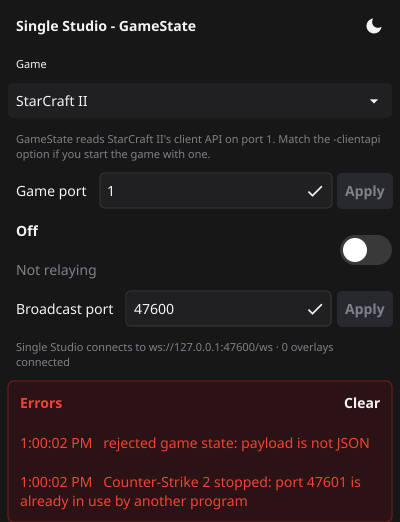

# Single Studio - GameState

A small local relay for game state feeds that a browser cannot read directly.
It acquires each game's data however that game requires, then pushes the raw
payloads to Single Studio over one local WebSocket. All shaping happens in
Single Studio; GameState does no diffing or transforming.

GameState is optional and separate from Single Studio. You only need it
for the titles below.

## Supported titles

| Title             | Namespace | How GameState gets the data                        | Status          |
| ----------------- | --------- | ------------------------------------------------------ | --------------- |
| Apex Legends      | `apex`    | Hosts a WebSocket server the game connects to (LiveAPI) | Implemented     |
| StarCraft II      | `sc2`     | Polls the client API `/game` and `/ui` on localhost:6119 | Implemented     |
| League of Legends | `lol`     | Polls live client data on https://127.0.0.1:2999        | Implemented     |
| Counter-Strike 2  | `cs2`     | Receives Game State Integration POSTs                   | Implemented     |
| Dota 2            | `dota2`   | Receives Game State Integration POSTs                   | Implemented     |
| Warcraft III      | `war3`    | Transport still to be confirmed                         | Not implemented |

## Download

Grab the build for your system from the
[Releases](https://github.com/fourcourtjester/single-studio-gamestate/releases) page:

| System                | File                                        | To run                                   |
| --------------------- | ------------------------------------------- | ---------------------------------------- |
| Windows               | `Single-Studio-GameState-windows-amd64.exe`   | Double-click it                          |
| Mac (Apple Silicon)   | `Single-Studio-GameState-macos-arm64.zip`     | Unzip, then open the app                 |
| Mac (Intel)           | `Single-Studio-GameState-macos-intel.zip`     | Unzip, then open the app                 |
| Linux                 | `Single-Studio-GameState-linux-amd64.tar.xz`  | Extract and run `usr/local/bin/gamestate`, or `make user-install` for a menu entry |

The builds are not code-signed yet. On Windows, SmartScreen may warn on first
launch ("More info" → "Run anyway"). On a Mac, right-click the app and choose
**Open** the first time.

## Usage

Opening GameState shows its window:



- **Game:** pick the title you're streaming. The choice is remembered.
- **On/off:** start or stop relaying. Switching games while on swaps over
  straight away; the old game's data stays in Single Studio.
- **Errors:** appears only when something goes wrong (a port already in use,
  a rejected GSI token). The window grows to fit it and shrinks back when
  cleared, unless you've resized the window yourself.

The window is dark by default; the button in its corner switches to light, and
the choice is remembered. GameState runs for as long as the window is
open: minimise it while you stream, close it to quit. Opening GameState
again while it's running brings the existing window forward.

Single Studio connects to `ws://127.0.0.1:47600/ws`. `GET /status` reports the
game, whether it is on, the connected overlay count and when the last payload
arrived.

For headless use (a server, or scripting), `-no-window` runs without a window:

```sh
gamestate -no-window -game sc2                 # relay StarCraft II immediately
gamestate -no-window -game sc2 -interval 250ms # poll at 4 Hz
gamestate -no-window -config gamestate.json    # read settings from a file; flags still win
```

### Per-game setup

- **CS2 / Dota 2:** the game only sends its state to the addresses listed in
  your Game State Integration config file. Creating and managing that file
  is up to you; GameState only needs its `uri` to be
  `http://127.0.0.1:47601/`. If the file sets an auth token, start GameState
  with the same `-gsi-token <secret>` and it will reject posts without it.
  The token is stripped before relaying.
- **Apex:** add these launch options:
  `+cl_liveapi_enabled 1 +cl_liveapi_ws_servers "ws://127.0.0.1:7777"`.
  JSON payloads are relayed as-is. Protobuf payloads are relayed base64-encoded.
- **StarCraft II and League:** no setup. Start a game or replay and
  GameState picks it up.

### Settings

| Flag         | JSON key         | Default                 | Used by    |
| ------------ | ---------------- | ----------------------- | ---------- |
| `-game`      | `game`           | none (pick in window)   | all        |
| `-bind`      | `bind`           | `127.0.0.1`             | all        |
| `-port`      | `port`           | `47600`                 | relay      |
| `-interval`  | `interval`       | `1s`                    | sc2, lol   |
| `-gsi-port`  | `gsiPort`        | `47601`                 | cs2, dota2 |
| `-gsi-token` | `gsiToken`       | none                    | cs2, dota2 |
| `-apex-port` | `apexPort`       | `7777`                  | apex       |
| `-sc2-url`   | `sc2Url`         | `http://127.0.0.1:6119` | sc2        |
| (none)       | `allowedOrigins` | `["*"]`                 | relay      |

Every listener binds to 127.0.0.1 by default, so nothing is reachable from
the network. The default ports are provisional.

## Wire format

Each WebSocket message is one JSON envelope:

```json
{ "ns": "sc2", "ts": 1790822970435, "data": { "game": { ... }, "ui": { ... } } }
```

- `ns` is the game namespace. Single Studio saves `data` under it.
- `ts` is the time GameState received the payload, in Unix milliseconds.
- `data` is the payload verbatim when it is JSON. Otherwise it is a base64
  string and `"encoding": "base64"` is set.

Full payloads are sent on every tick, and Yjs only emits updates for keys
that changed. A newly connected client immediately receives the latest
payload.

## Development

The window uses [Fyne](https://fyne.io), which needs a C compiler and, on
Linux, the OpenGL and X11/Wayland headers:

```sh
sudo apt-get install gcc libgl1-mesa-dev xorg-dev libwayland-dev libxkbcommon-dev wayland-protocols
go test -race ./...
go run ./cmd/gamestate
```

Each OS is built on its own machine. CI does this for every push, and pushing
a `v*` tag publishes the builds as a GitHub Release. To package locally:

```sh
go install fyne.io/tools/cmd/fyne@v1.7.3
cd cmd/gamestate && fyne package --target linux --release   # or windows / darwin on those systems
```

`PANEL_SHOTS=<dir> go test -run Screenshots ./internal/ui` renders the window
in each state to PNGs, for checking visual changes.

Layout:

- `cmd/gamestate`: flags, the relay server and the window
- `internal/relay`: the envelope and the WebSocket fan-out hub
- `internal/adapter`: per-title acquisition (poll, receive HTTP, host a WebSocket)
- `internal/config`: settings, defaults, validation and remembered choices
- `internal/control`: starts, stops and switches the adapter; collects errors
- `internal/ui`: the window's panel, its on/off switch and theme
